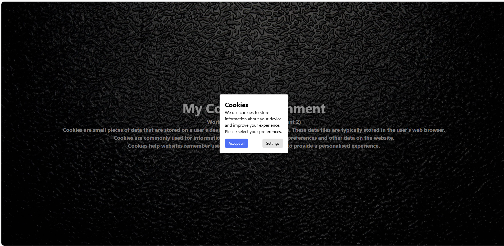

# Cookie Management System
## Overview

This project is a browser-based Cookie Management System created using HTML, CSS, and JavaScript. 

The application displays a cookie consent dialog, allows users to accept cookies or customize preferences, and stores browser-related information using cookies.
## Tech Skills

- HTML5
- CSS3
- JavaScript
- Browser Cookies
- GitHub Pages
## How to Install / Run

###  Run Online

Open the live application:

https://daljitkaur08.github.io/kaur_daljit_cookies_assignment01/

## Project :
 - Shows a cookie dialog if no cookies exist (after a short delay)
- Lets user **Accept All** or choose custom settings
- Stores:
  - Browser name  
  - Operating system  
  - Screen width  
  - Screen height
 
  ## Author

Daljit Kaur

- GitHub: https://github.com/DaljitKaur08
- LinkedIn: https://www.linkedin.com/in/daljit-kaur-mitt/

---

## License

This project is licensed under the MIT License.
  
  ## Preview :
  

  ## link 
  https://daljitkaur08.github.io/kaur_daljit_cookies_assignment01/
